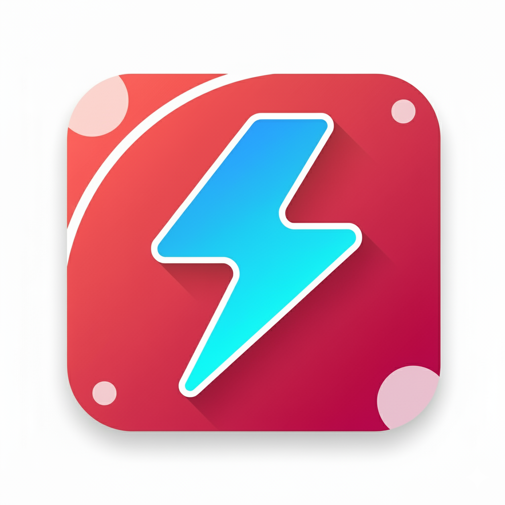
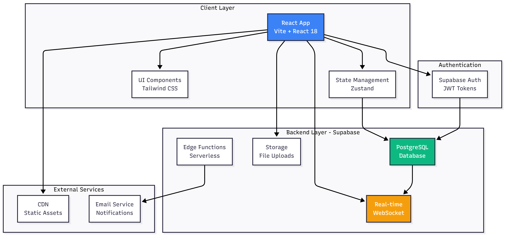

# NexFlow - Collaborative Project Management Platform

A modern, real-time collaborative project management platform combining Confluence-style documentation with Jira-style kanban boards, built with React and Supabase.



## 🚀 Features

### 📝 Rich Document Editor

- Real-time collaboration with multiple users
- Rich text editing powered by TipTap/ProseMirror
- Live cursors showing where team members are typing
- Version history with restore capability
- Nested hierarchical page structures

### 📊 Kanban Boards

- Customizable workflow columns
- Drag & drop card management
- Colored labels and card organization
- Due dates and priority levels
- Team member assignments

### 👥 Team Collaboration

- Role-based access control (Owner, Admin, Editor, Viewer)
- @Mentions in comments
- Real-time notifications
- Activity feed tracking
- Comments and discussions on pages and cards

### 🎨 Modern UI/UX

- Clean, professional interface
- Dark mode ready
- Fully responsive design
- Smooth animations
- Customizable project themes

## 🏗️ Architecture

### Tech Stack

**Frontend:** React 18, Vite, React Router v6, Zustand, TipTap, Lucide React, Tailwind CSS

**Backend:** Supabase (PostgreSQL, Real-time subscriptions, Row Level Security, Authentication)

### System Architecture



The platform follows a modern client-server architecture with real-time capabilities powered by Supabase's real-time engine.

### Database Architecture


**Core Tables:** profiles, projects, project_members, pages, page_versions, page_presence

**Kanban Tables:** boards, board_columns, cards, labels, card_labels

**Collaboration:** comments, mentions, activities, notifications

### Real-time Collaboration Architecture


Real-time features include collaborative editing with live cursors, presence tracking, and instant updates across all connected clients.

## 📦 Getting Started

### Prerequisites

- Node.js 16+
- Supabase account
- Git

### Installation

1. **Clone the repository**

```bash
git clone https://github.com/Prathamesh-2005/NexFlow.git
cd frontcort
```

2. **Install dependencies**

```bash
npm install
```

3. **Setup Supabase**

   - Create a new project at [supabase.com](https://supabase.com)
   - Copy your project URL and anon key
   - Run the SQL schema from `/docs/database-schema.sql` in Supabase SQL Editor

4. **Configure environment**

Create `.env` file:

```env
VITE_SUPABASE_URL=https://your-project.supabase.co
VITE_SUPABASE_ANON_KEY=your-anon-key-here
```

5. **Start the app**

```bash
npm run dev
```

6. **Open browser**
   - Visit `http://localhost:5173`
   - Sign up and create your first project!

## 🚀 Deployment

### Build for Production

Run `npm run build` to create production bundle in `dist/` folder.

### Recommended Platforms

- **Vercel** (Recommended)
- **Netlify**
- Any static hosting service

### Environment Variables

Configure these in your hosting platform:

- `VITE_SUPABASE_URL`
- `VITE_SUPABASE_ANON_KEY`

### Post-Deployment Checklist

1. Update Supabase URL configuration with production domain
2. Test all features in production environment
3. Monitor Supabase logs for errors

## 📚 API Reference

### Supabase Helper Functions

#### Project Management

- `getUserProjects(userId)` - Fetch all projects for a user with caching
- `getProjectWithPages(projectId, userId)` - Fetch project details with pages and user role
- `createProject(projectData)` - Create new project
- `updateProject(projectId, updates)` - Update project details
- `deleteProject(projectId)` - Delete project and all related data

#### Page Management

- `getPage(pageId)` - Fetch single page with content
- `createPage(pageData)` - Create new page
- `updatePage(pageId, updates)` - Update page content
- `deletePage(pageId)` - Delete page
- `getPageVersions(pageId)` - Fetch version history

#### Collaboration

- `addComment(pageId, content)` - Add comment to page
- `mentionUser(userId, contextId)` - Create mention notification
- `getActivities(projectId)` - Fetch activity feed
- `updatePresence(pageId, cursorPosition)` - Update user cursor position

#### User Management

- `getProfile(userId)` - Fetch user profile
- `updateProfile(userId, updates)` - Update user profile
- `getProjectMembers(projectId)` - Fetch project team members
- `updateMemberRole(memberId, role)` - Update member permissions

#### Board Management

- `getBoard(boardId)` - Fetch kanban board with columns and cards
- `createCard(cardData)` - Create new card
- `updateCard(cardId, updates)` - Update card details
- `moveCard(cardId, columnId, position)` - Move card between columns

## 🔒 Security

### Row Level Security

All database tables have RLS policies ensuring users can only access data they have permission to view. Policies are enforced at the database level for maximum security.

### Authentication

- Email/password authentication via Supabase Auth
- JWT tokens with automatic refresh
- Protected routes with authentication guards
- Session management

### Best Practices

- All API requests authenticated
- Input validation on client and server
- XSS protection via React
- CSRF protection via Supabase
- Rate limiting on authentication endpoints

## 🐛 Known Limitations

1. **File Uploads** - Currently limited to external URLs only
2. **Offline Mode** - Requires active internet connection
3. **Mobile Editor** - Better optimized for tablet/desktop
4. **Search** - Basic title search only, no full-text search
5. **Exports** - No PDF/Word export functionality yet
6. **Performance** - Large documents (10,000+ words) may slow down
7. **Browser Support** - Best on modern browsers with ES6+ support

## 🚧 Roadmap

### Phase 1 (Q1 2024)

Direct file uploads, enhanced mobile experience, dark mode, email notifications, advanced search

### Phase 2 (Q2 2024)

Document templates, PDF/Markdown export, calendar view, time tracking, Gantt charts

### Phase 3 (Q3 2024)

Slack/Discord integrations, public sharing, custom domains, webhooks, analytics

### Phase 4 (Q4 2024)

AI suggestions, voice/video calls, desktop apps, mobile apps, enterprise SSO

## 🤝 Contributing

Contributions are welcome! Please:

1. Fork the repository
2. Create a feature branch
3. Commit your changes with clear messages
4. Push to your branch
5. Open a Pull Request

Follow existing code style, add tests for new features, and update documentation.

## 📄 License

MIT License - see LICENSE file for details.

## 👏 Acknowledgments

Built with: Supabase, TipTap, Tailwind CSS, Lucide Icons, Zustand

**Built with ❤️ by the Prathamesh Jadhav**

⭐ Star us on GitHub if you find this useful!
